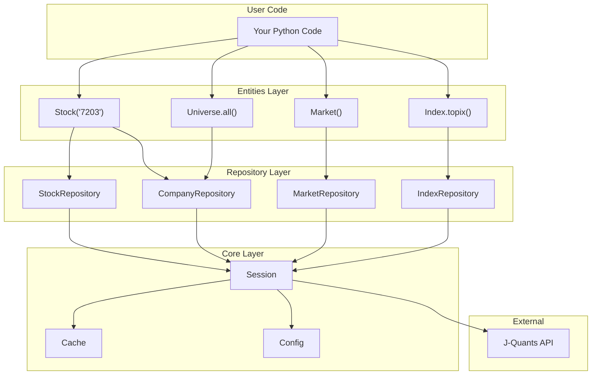
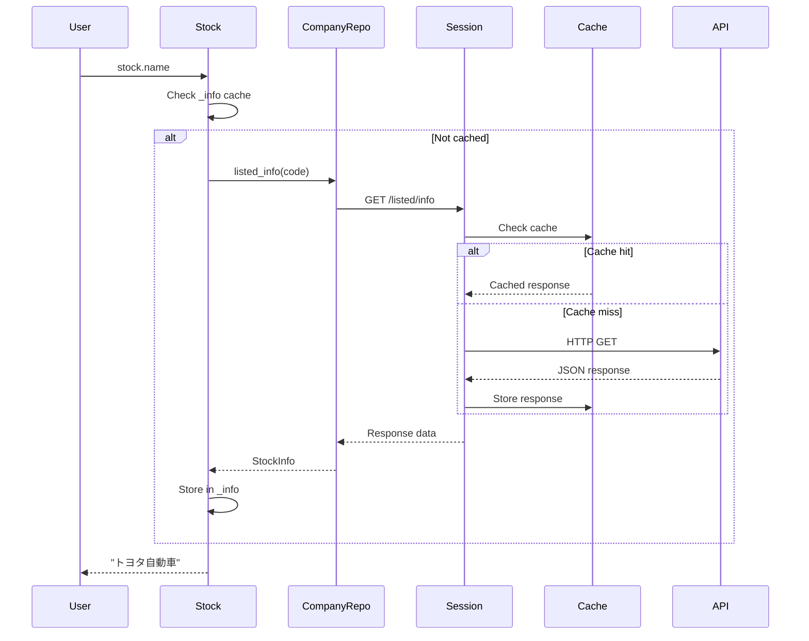
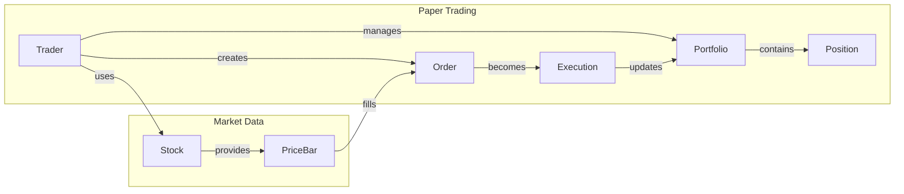

# Architecture

PyJQuants follows a layered architecture that separates concerns and provides a clean, intuitive API.

## High-Level Overview



## Layer Responsibilities

### Entities Layer

The **entities layer** provides the user-facing OOP interface. These classes are what you import and use directly.

| Entity | Purpose |
|--------|---------|
| `Stock` | Single stock with lazy-loaded properties |
| `Index` | Market indices (TOPIX, etc.) |
| `Market` | Trading calendar and sector info |
| `Universe` | Filterable collection of stocks |

**Key pattern**: Lazy loading. Properties like `stock.name` fetch data only on first access.

### Repository Layer

The **repository layer** handles all API communication. Each repository is responsible for a specific domain.

| Repository | API Endpoints |
|------------|---------------|
| `StockRepository` | Daily quotes, prices |
| `CompanyRepository` | Listed info, financials, dividends |
| `MarketRepository` | Trading calendar, sectors, margin data |
| `IndexRepository` | Index prices and components |

### Core Layer

The **core layer** provides infrastructure services.

| Component | Purpose |
|-----------|---------|
| `Session` | HTTP client with authentication |
| `Cache` | Disk-based response caching |
| `Config` | Environment and TOML configuration |

## Data Flow



## Package Structure

```
pyjquants/
├── __init__.py         # Public API exports
├── core/               # Infrastructure
│   ├── session.py      # HTTP + auth
│   ├── async_session.py
│   ├── config.py       # Config loading
│   ├── cache.py        # Disk cache
│   └── exceptions.py   # Custom errors
├── entities/           # User-facing OOP
│   ├── stock.py        # Stock class
│   └── index.py        # Index class
├── models/             # Pydantic models
│   ├── price.py        # PriceBar
│   ├── company.py      # StockInfo, Sector
│   ├── financials.py   # Statements
│   ├── market.py       # Market data
│   └── enums.py        # Enumerations
├── repositories/       # API access
│   ├── base.py         # BaseRepository
│   ├── stock.py
│   ├── company.py
│   ├── market.py
│   └── index.py
├── collections/        # Multi-entity
│   ├── universe.py     # Universe
│   └── market.py       # Market
├── trading/            # Paper trading
│   ├── trader.py       # Trader
│   ├── order.py        # Order, Execution
│   └── portfolio.py    # Portfolio, Position
└── utils/
    └── date.py         # Date helpers
```

## Trading System



## Design Decisions

### Why Lazy Loading?

Stock objects are cheap to create. Fetching data happens only when needed:

```python
# No API call yet
stock = pjq.Stock("7203")

# API call happens here (cached afterward)
name = stock.name
```

### Why Repository Pattern?

Separates API details from business logic:

- Entities don't know about HTTP
- Repositories can be mocked for testing
- API changes are isolated to one layer

### Why Global Session?

Convenience without complexity:

```python
# Session auto-created from env vars
stock = pjq.Stock("7203")

# Or explicit session for testing
session = pjq.Session(mail="...", password="...")
stock = pjq.Stock("7203", session=session)
```
